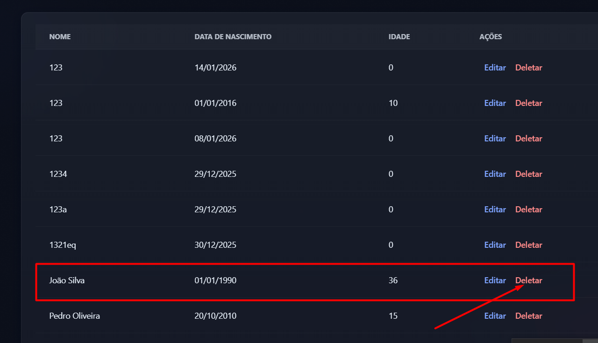
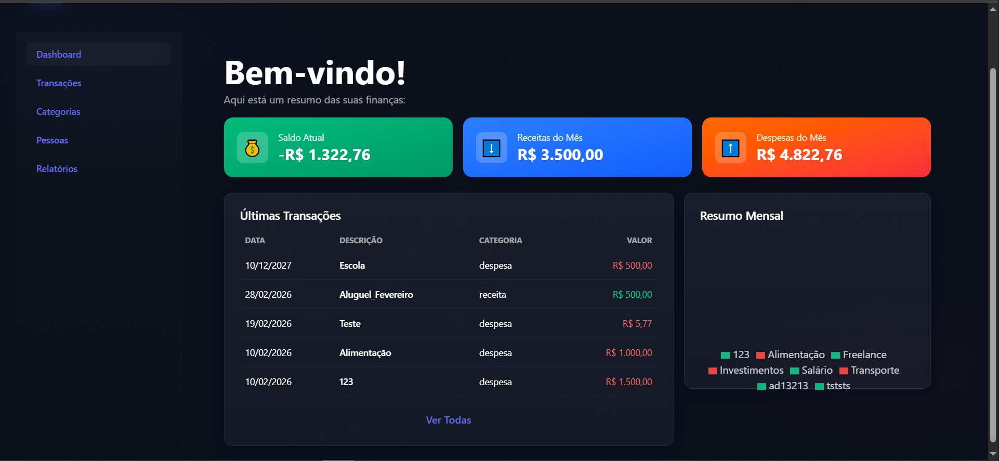
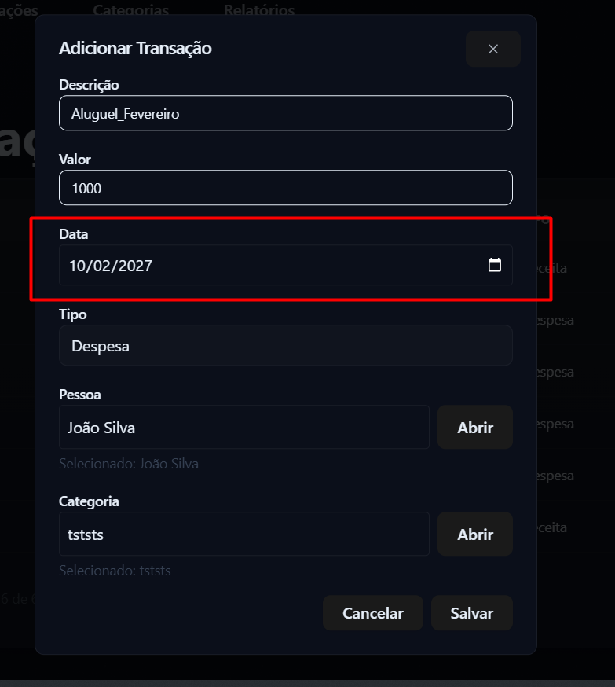
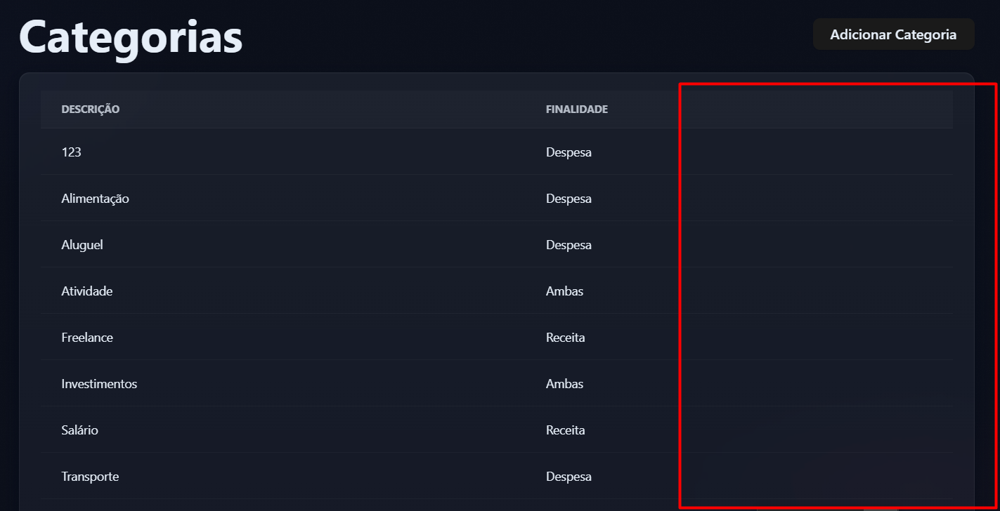
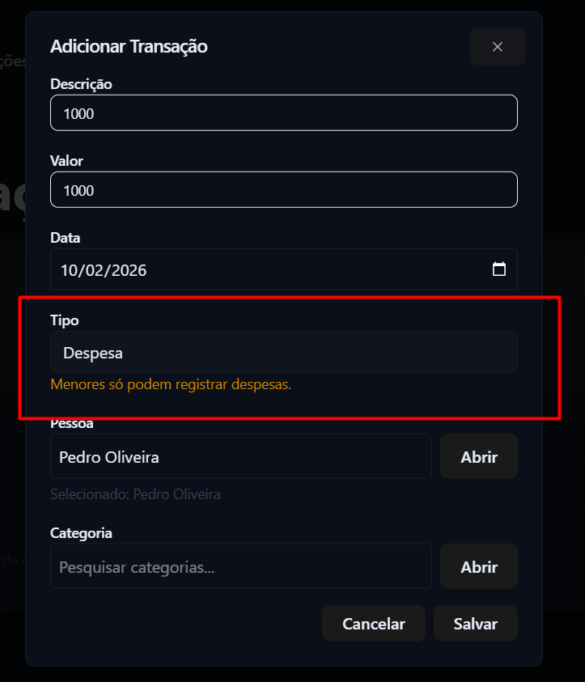
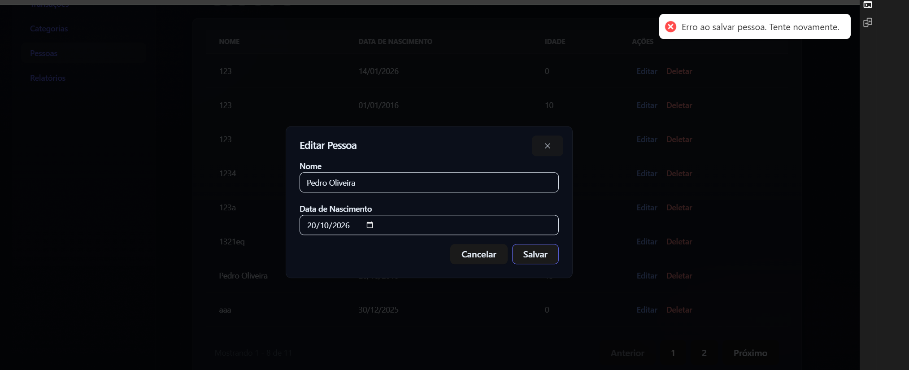
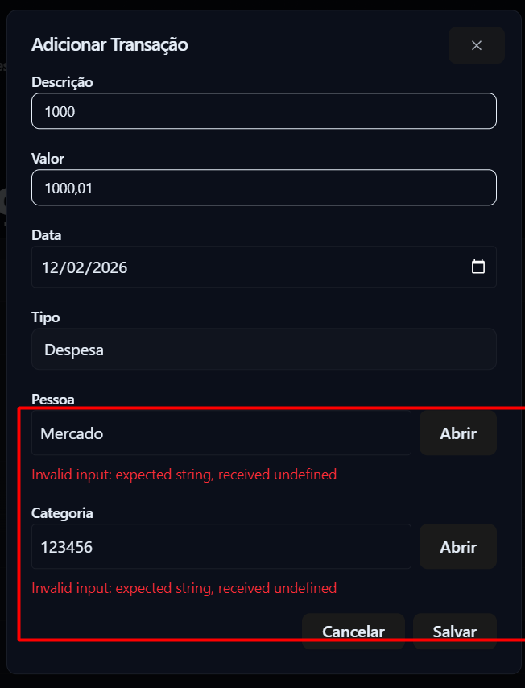
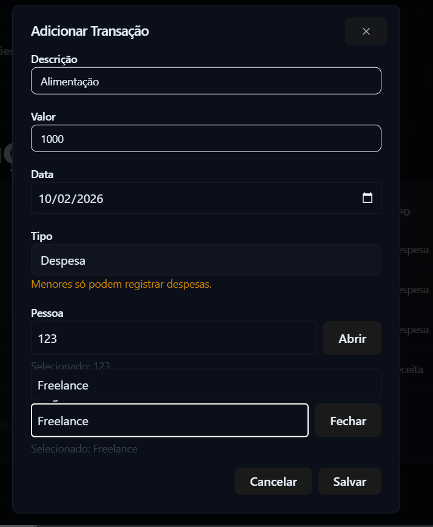
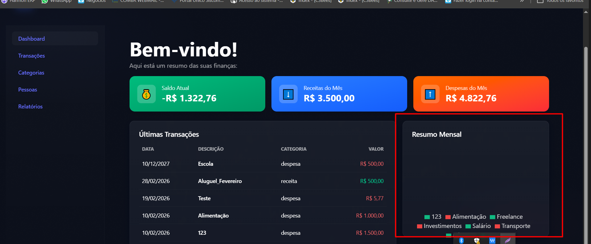

# Bugs e Problemas Encontrados — Minhas Finanças

> Documento de registro de todos os bugs e problemas identificados durante os testes automatizados e exploratórios do sistema Minhas Finanças.
> Total: **24 bugs documentados**

---

## Índice

| # | Tipo | Descrição resumida |
|---|------|-------------------|
| 1 | API/Backend | PUT e DELETE não implementados para Categorias e Transações |
| 2 | Backend | Setter `internal` impede teste unitário direto da regra "menor não pode receita" |
| 3 | Backend | Setter `internal` impede teste unitário direto da regra "maior pode receita" |
| 4 | Negócio | Registros duplicados sem diferenciação (mesmo nome/descrição) |
| 5 | Usabilidade | Ausência de botões para editar/excluir categorias |
| 6 | Usabilidade | Mensagem de aviso persiste com campo despesa já selecionado para menor |
| 7 | Usabilidade | Mensagem genérica ao salvar pessoa com data de nascimento futura |
| 8 | Usabilidade | Input aceita dados inexistentes em Pessoa e Categoria |
| 9 | Negócio | Exclusão em cascata sem validação e mensagem de confirmação pouco informativa |
| 10 | Negócio | Dashboard soma receitas e despesas de datas futuras |
| 11 | Usabilidade | Ausência de botão de impressão no relatório Totais por Pessoa |
| 12 | Visual | Dashboard não exibe gráfico com valores altos |
| 13 | Usabilidade | Ausência de botões para editar/excluir transação |
| 14 | Visual | Colunas Categoria e Pessoa vazias no painel de transações |
| 15 | Negócio | Permite cadastrar transação com data futura |
| 16 | Usabilidade | Mensagem técnica ao salvar transação sem data |
| 17 | Usabilidade | Combobox de categoria não limpa busca ao trocar seleção |
| 18 | Usabilidade | Mensagem genérica ao salvar transação inválida |
| 19 | Negócio | Categoria de Receita disponível para menor de idade |
| 20 | Visual | Dashboard com sobreposição de textos e legendas |
| 21 | API/Backend | DELETE de Pessoa retorna 204 para ID inexistente |
| 22 | API/Backend | PUT não implementado em Categoria (405) |
| 23 | API/Backend | DELETE não implementado em Categoria (405) |
| 24 | API/Backend | PUT não implementado em Transação (405) |
| 25 | API/Backend | DELETE não implementado em Transação (405) |

---

# Bugs da API/Backend

---

## Bug #1 — PUT e DELETE não implementados para Categorias e Transações

**Tipo:** API/Backend  
**Severidade:** Alta

**Descrição:**  
Os controllers `CategoriasController` e `TransacoesController` não possuem endpoints `PUT/{id}` e `DELETE/{id}`, impedindo a atualização e exclusão desses registros. Os endpoints disponíveis são apenas `GET` (listagem e por ID) e `POST` (criação).

**Endpoints afetados:**
- `PUT /api/v1/Categorias/{id}` → 405 Method Not Allowed
- `DELETE /api/v1/Categorias/{id}` → 405 Method Not Allowed
- `PUT /api/v1/Transacoes/{id}` → 405 Method Not Allowed
- `DELETE /api/v1/Transacoes/{id}` → 405 Method Not Allowed

**Comportamento esperado:**  
Todos os endpoints CRUD (POST, GET, PUT, DELETE) devem estar implementados para todas as entidades.

**Comportamento observado:**  
`PUT` e `DELETE` retornam `405 Method Not Allowed`.

**Impacto:**  
Não é possível atualizar ou excluir categorias e transações via API, impedindo o gerenciamento completo dos dados.

**Localização no código:**
- `api/MinhasFinancas.API/Controllers/CategoriasController.cs` — faltam métodos `Update` e `Delete`
- `api/MinhasFinancas.API/Controllers/TransacoesController.cs` — faltam métodos `Update` e `Delete`

---

## Bug #2 — Setter `internal` impede teste unitário da regra "menor não pode receita"

**Tipo:** Backend/Design  
**Severidade:** Média

**Descrição:**  
A propriedade `Pessoa` da classe `Transacao` tem setter `internal`, impedindo a associação de uma pessoa a uma transação em código de teste fora do assembly do domínio.

**Impacto:**  
Não é possível validar via teste unitário direto que menores de idade não podem registrar receitas. A regra é validada via testes de integração e E2E.

**Localização no código:**
- `api/MinhasFinancas.Domain/Entities/Transacao.cs` — setter `internal` na propriedade `Pessoa`

**Sugestão:**  
Expor um método público ou construtor que permita a validação da regra, ou usar `InternalsVisibleTo` no assembly do domínio.

---

## Bug #3 — Setter `internal` impede teste unitário da regra "maior pode receita"

**Tipo:** Backend/Design  
**Severidade:** Média

**Descrição:**  
A mesma limitação do Bug #2 impede a validação automatizada de que maiores de idade podem registrar receitas via teste unitário.

**Localização no código:**
- `api/MinhasFinancas.Domain/Entities/Transacao.cs` — setter `internal` na propriedade `Pessoa`

---

# Bugs de Regra de Negócio

---

## Bug #4 — Registros duplicados sem diferenciação

**Tipo:** Negócio  
**Severidade:** Média

**Descrição:**  
O sistema permite cadastrar múltiplas pessoas, categorias e transações com a mesma descrição/nome, sem campos adicionais para diferenciação (CPF, código, etc.).

**Reprodução:**
1. Cadastre várias pessoas com o mesmo nome
2. Cadastre várias categorias com a mesma descrição
3. Acesse as listagens — não há como distinguir os registros

**Comportamento esperado:**  
Cada registro deveria ter campos únicos (CPF, código, etc.) para diferenciação.

**Impacto:**  
Dificulta auditoria, relatórios e pode causar confusão em operações financeiras.

**Evidências:**  

---

## Bug #5 — Exclusão em cascata sem validação e mensagem pouco informativa

**Tipo:** Negócio/Usabilidade  
**Severidade:** Alta

**Descrição:**  
Ao deletar uma pessoa, todas as transações associadas são excluídas em cascata sem aviso detalhado. A mensagem de confirmação é genérica e não informa o impacto da ação.

**Reprodução:**
1. Cadastre uma pessoa e associe transações
2. Clique em "Deletar" ao lado da pessoa
3. Confirme — todas as transações somem do dashboard e relatórios

**Comportamento esperado:**  
O sistema deve informar claramente o impacto (ex: "Ao deletar esta pessoa, X transações serão removidas permanentemente").

**Impacto:**  
Perda de histórico financeiro sem possibilidade de recuperação.

**Evidências:**  

**Localização no código:**
- Frontend: `web/src/pages/PessoasList.tsx`
- Backend: regra de exclusão em cascata em `MinhasFinancas.Application` / `MinhasFinancas.Domain`

---

## Bug #6 — Dashboard soma receitas e despesas de datas futuras

**Tipo:** Negócio  
**Severidade:** Alta

**Descrição:**  
O dashboard inclui transações com datas futuras no cálculo de "Receitas do Mês" e "Despesas do Mês", gerando totais incorretos.

**Reprodução:**
1. Cadastre uma transação com data futura (ex: 10/12/2027)
2. Acesse o dashboard
3. Os totais incluem a transação futura

**Comportamento esperado:**  
Apenas transações do período vigente devem ser consideradas nos totais.

**Evidências:**  

**Localização no código:**
- Frontend: `web/src/pages/Dashboard.tsx`
- Backend: possível ausência de filtro por data nas queries de totais

---

## Bug #7 — Permite cadastrar transação com data futura

**Tipo:** Negócio  
**Severidade:** Média

**Descrição:**  
O sistema permite cadastrar despesas ou receitas com data futura sem qualquer alerta ou bloqueio.

**Reprodução:**
1. Abra o formulário de transação
2. Selecione uma data futura (ex: 10/02/2027)
3. Salve — a transação é cadastrada normalmente

**Comportamento esperado:**  
Bloquear ou alertar ao cadastrar transação com data futura.

**Evidências:**  

**Localização no código:**
- Frontend: `web/src/components/molecules/TransacaoForm.tsx`
- Backend: validação em `MinhasFinancas.Application` ou `MinhasFinancas.Domain`

---

## Bug #8 — Categoria de Receita disponível para menor de idade

**Tipo:** Negócio  
**Severidade:** Alta

**Descrição:**  
Ao cadastrar uma transação para um menor de idade (campo "Tipo" bloqueado em "Despesa"), o combobox de categoria permite selecionar categorias do tipo Receita, violando a regra de negócio.

**Reprodução:**
1. Cadastre um menor de idade
2. Abra o formulário de transação
3. O combobox de categoria lista categorias de Receita (ex: Freelance)

**Comportamento esperado:**  
Para menores, apenas categorias do tipo Despesa ou Ambas devem ser listadas.

**Evidências:**  

**Localização no código:**
- Frontend: `web/src/components/molecules/TransacaoForm.tsx`

---

# Bugs de Usabilidade

---

## Bug #9 — Ausência de botões para editar e excluir categorias

**Tipo:** Usabilidade  
**Severidade:** Média

**Descrição:**  
Na tela de categorias, não há botões para editar ou excluir categorias cadastradas.

**Evidências:**  

**Localização no código:**
- Frontend: `web/src/pages/CategoriasList.tsx`

---

## Bug #10 — Mensagem de aviso persiste com campo despesa já selecionado para menor

**Tipo:** Usabilidade  
**Severidade:** Baixa

**Descrição:**  
Com o campo "Tipo" bloqueado em "Despesa" para menores, o aviso "Menores só podem registrar despesas" permanece visível, sendo redundante.

**Evidências:**  

**Localização no código:**
- Frontend: `web/src/components/molecules/TransacaoForm.tsx`

---

## Bug #11 — Mensagem genérica ao salvar pessoa com data de nascimento futura

**Tipo:** Usabilidade  
**Severidade:** Média

**Descrição:**  
Ao salvar pessoa com data de nascimento futura, exibe apenas "Erro ao salvar pessoa. Tente novamente." sem informar o motivo.

**Comportamento esperado:**  
"A data de nascimento não pode ser posterior à data atual."

**Evidências:**  

**Localização no código:**
- Frontend: `web/src/components/molecules/PessoaForm.tsx`
- Backend: validação em `MinhasFinancas.Application`

---

## Bug #12 — Input aceita dados inexistentes em Pessoa e Categoria

**Tipo:** Usabilidade  
**Severidade:** Média

**Descrição:**  
É possível digitar valores inexistentes nos campos "Pessoa" e "Categoria" do formulário de transação, causando erro ao salvar: "Invalid input: expected string, received undefined".

**Evidências:**  

**Localização no código:**
- Frontend: `web/src/components/molecules/TransacaoForm.tsx`

---

## Bug #13 — Ausência de botão de impressão no relatório Totais por Pessoa

**Tipo:** Usabilidade  
**Severidade:** Baixa

**Descrição:**  
No relatório "Totais por Pessoa", não há botão para acionar a impressão do navegador.

**Evidências:**  

**Localização no código:**
- Frontend: `web/src/pages/TotaisPorPessoa.tsx`

---

## Bug #14 — Ausência de botões para editar e excluir transação

**Tipo:** Usabilidade  
**Severidade:** Média

**Descrição:**  
No painel de transações, não há botões para editar ou excluir transações cadastradas.

**Evidências:**  

**Localização no código:**
- Frontend: `web/src/pages/TransacoesList.tsx`

---

## Bug #15 — Mensagem técnica ao salvar transação sem data

**Tipo:** Usabilidade  
**Severidade:** Média

**Descrição:**  
Ao salvar transação sem preencher a data, exibe mensagem técnica: "Invalid input: expected date, received Date".

**Comportamento esperado:**  
"Por favor, preencha a data da transação."

**Evidências:**  

**Localização no código:**
- Frontend: `web/src/components/molecules/TransacaoForm.tsx`

---

## Bug #16 — Combobox de categoria não limpa busca ao trocar seleção

**Tipo:** Usabilidade  
**Severidade:** Baixa

**Descrição:**  
Ao trocar a categoria, o combobox mantém o valor anterior no campo de busca, ocultando as demais opções.

**Evidências:**  

**Localização no código:**
- Frontend: `web/src/components/molecules/TransacaoForm.tsx`

---

## Bug #17 — Mensagem genérica ao salvar transação inválida

**Tipo:** Usabilidade  
**Severidade:** Média

**Descrição:**  
Ao salvar transação inválida (ex: menor com categoria de receita), exibe apenas "Erro ao salvar transação. Tente novamente." sem detalhar o motivo.

**Evidências:**  

**Localização no código:**
- Frontend: `web/src/components/molecules/TransacaoForm.tsx`
- Backend: `MinhasFinancas.Application`

---

# Bugs Visuais

---

## Bug #18 — Dashboard não exibe gráfico com valores altos

**Tipo:** Visual  
**Severidade:** Média

**Descrição:**  
Quando a receita ou o número de transações atinge valores altos, o painel "Resumo Mensal" deixa de exibir o gráfico, mostrando apenas a legenda.

**Evidências:**  

**Localização no código:**
- Frontend: `web/src/pages/Dashboard.tsx`

---

## Bug #19 — Colunas Categoria e Pessoa vazias no painel de transações

**Tipo:** Visual  
**Severidade:** Alta

**Descrição:**  
As colunas "Categoria" e "Pessoa" no painel de transações estão presentes mas não exibem informação, mesmo com dados cadastrados.

**Evidências:**  

**Localização no código:**
- Frontend: `web/src/pages/TransacoesList.tsx`

---

## Bug #20 — Dashboard com sobreposição de textos e legendas

**Tipo:** Visual  
**Severidade:** Baixa

**Descrição:**  
O dashboard apresenta sobreposição de textos e legendas no gráfico, tornando os dados ilegíveis.

**Evidências:**  

**Localização no código:**
- `web/src/pages/Dashboard.tsx` — `DashboardPanel`, linhas 18–121

---

# Bugs Encontrados nos Testes de Integração CRUD

---

## Bug #21 — DELETE de Pessoa retorna 204 para ID inexistente

**Tipo:** API/Backend  
**Severidade:** Baixa

**Descrição:**  
Ao tentar excluir uma pessoa com ID inexistente, a API retorna `204 No Content` em vez de `404 Not Found`, indicando que não verifica a existência do registro antes de executar a exclusão.

**Reprodução:**
1. `DELETE /api/v1/Pessoas/{guid-inexistente}`
2. API retorna 204 em vez de 404

**Comportamento esperado:** `404 Not Found`  
**Comportamento observado:** `204 No Content`

**Localização no código:**
- `api/MinhasFinancas.API/Controllers/PessoasController.cs` — método `Delete`
- `PessoaService.DeleteAsync` não lança `KeyNotFoundException` quando o ID não existe

---

## Bug #22 — PUT não implementado em Categoria (405)

**Tipo:** API/Backend  
**Severidade:** Alta

**Descrição:**  
`PUT /api/v1/Categorias/{id}` retorna `405 Method Not Allowed`. O endpoint não existe no `CategoriasController`.

**Localização no código:**
- `api/MinhasFinancas.API/Controllers/CategoriasController.cs` — falta método com `[HttpPut("{id}")]`

---

## Bug #23 — DELETE não implementado em Categoria (405)

**Tipo:** API/Backend  
**Severidade:** Alta

**Descrição:**  
`DELETE /api/v1/Categorias/{id}` retorna `405 Method Not Allowed`. O endpoint não existe no `CategoriasController`.

**Localização no código:**
- `api/MinhasFinancas.API/Controllers/CategoriasController.cs` — falta método com `[HttpDelete("{id}")]`

---

## Bug #24 — PUT não implementado em Transação (405)

**Tipo:** API/Backend  
**Severidade:** Alta

**Descrição:**  
`PUT /api/v1/Transacoes/{id}` retorna `405 Method Not Allowed`. O endpoint não existe no `TransacoesController`.

**Localização no código:**
- `api/MinhasFinancas.API/Controllers/TransacoesController.cs` — falta método com `[HttpPut("{id}")]`

---

## Bug #25 — DELETE não implementado em Transação (405)

**Tipo:** API/Backend  
**Severidade:** Alta

**Descrição:**  
`DELETE /api/v1/Transacoes/{id}` retorna `405 Method Not Allowed`. O endpoint não existe no `TransacoesController`.

**Localização no código:**
- `api/MinhasFinancas.API/Controllers/TransacoesController.cs` — falta método com `[HttpDelete("{id}")]`
