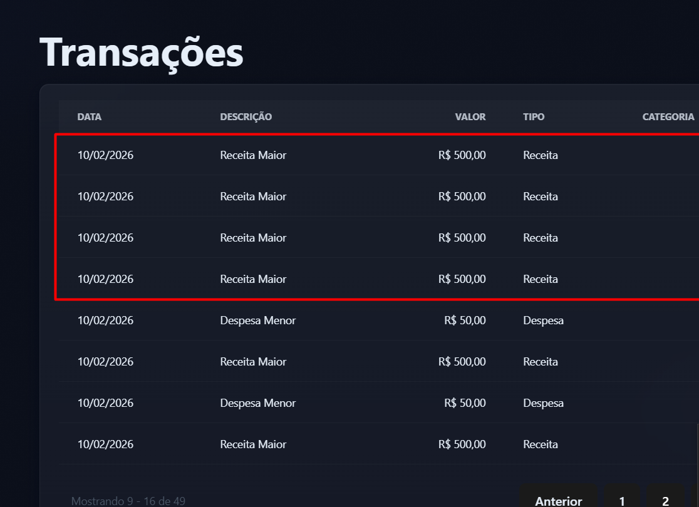
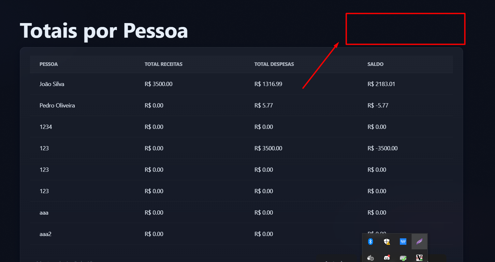
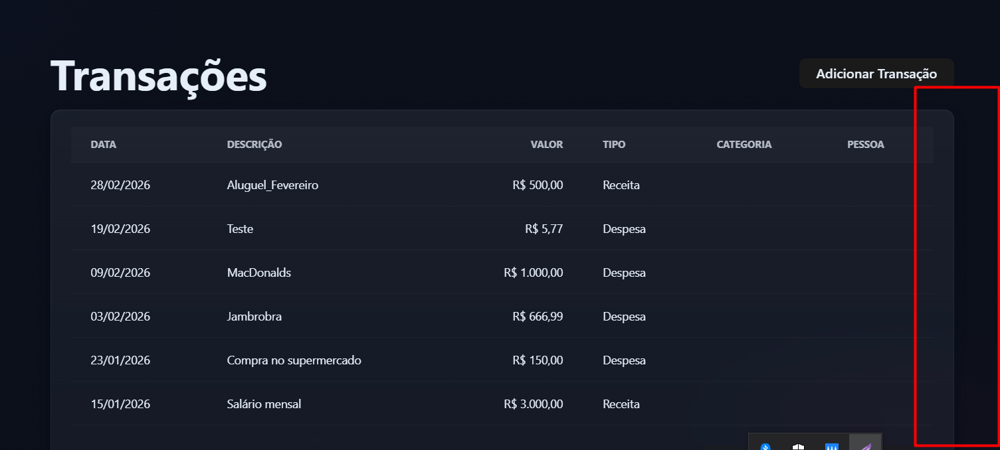
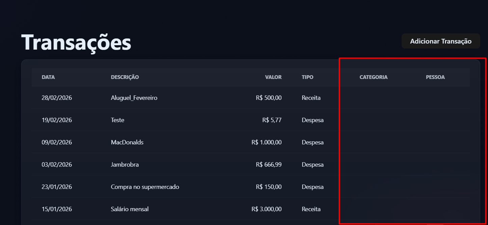
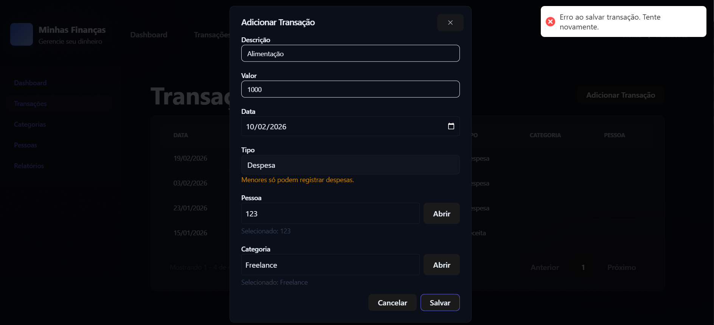
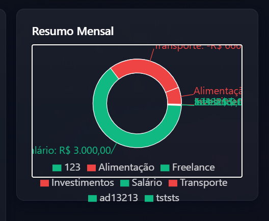

---

# Bug de negócio — Registros duplicados sem diferenciação

**Descrição:**
O sistema permite o cadastro de múltiplas pessoas, categorias e transações com a mesma descrição/nome. Isso dificulta a diferenciação dos registros em relatórios e consultas, pois não há informações adicionais para distinguir cada item.

**Reprodução:**
1. Cadastre várias pessoas com o mesmo nome (ex: "Menor E2E").
2. Cadastre várias categorias com a mesma descrição (ex: "Categoria Receita E2E").
3. Cadastre várias transações com a mesma descrição, valor e data (ex: "Receita Maior").
4. Acesse os relatórios ou listagens.

**Comportamento esperado:**
Cada registro deveria ter informações únicas ou adicionais (ex: sexo, CPF, RG, data de nascimento para pessoas; código ou descrição única para categorias; identificador único ou detalhamento para transações), facilitando a distinção.

**Comportamento observado:**
Não há como diferenciar registros apenas pelo nome/descrição, dificultando a análise e rastreabilidade.

**Impacto:**
Dificulta a auditoria, relatórios e pode causar confusão ou erros em operações financeiras.

**Evidências:**

**Sugestão de melhoria:**
Adicionar campos obrigatórios e/ou únicos para:
- Pessoas: sexo, CPF, RG, data de nascimento, etc.
- Categorias: descrição única ou código identificador.
- Transações: algum identificador único ou detalhamento adicional.

---

# Bug de usabilidade — Ausência de botões para editar e excluir categorias

**Descrição:**
Na tela de categorias, não há botões visíveis para editar ou excluir uma categoria já cadastrada. Isso limita a usabilidade e impede o gerenciamento completo das categorias pelo usuário.

**Reprodução:**
1. Acesse a tela/listagem de categorias.
2. Observe que não há botões de ação (editar/excluir) ao lado de cada categoria.

**Comportamento esperado:**
Cada linha da tabela de categorias deve apresentar botões para editar e excluir a categoria correspondente.

**Comportamento observado:**
Não há botões de ação disponíveis, impossibilitando a edição ou exclusão de categorias.

**Impacto:**
O usuário não consegue corrigir ou remover categorias erradas, prejudicando o controle e organização das transações.

**Evidências:**

**Localização no código:**
- Frontend: `web/src/pages/CategoriasList.tsx` (renderização da tabela de categorias; adicionar botões de ação nas linhas da tabela)

---
---

# Bug de usabilidade — Mensagem de aviso persiste mesmo com campo despesa já selecionado para menor

**Descrição:**
Ao cadastrar uma transação para uma pessoa menor de idade, o campo "Tipo" já está bloqueado em "Despesa", mas o aviso "Menores só podem registrar despesas." permanece visível, mesmo não havendo possibilidade de selecionar outro tipo.

**Reprodução:**
1. Cadastre uma pessoa menor de idade.
2. Abra o formulário de transação.
3. Observe que o campo "Tipo" está bloqueado em "Despesa" e o aviso persiste.

**Comportamento esperado:**
O aviso só deveria aparecer se o usuário tentasse selecionar outro tipo, ou se o campo estivesse desbloqueado. Com o campo bloqueado, o aviso é redundante.

**Comportamento observado:**
O aviso permanece visível, mesmo sem possibilidade de erro.

**Impacto:**
Pode causar confusão ou poluição visual, já que o usuário não tem como errar nesse contexto.

**Evidências:**

**Localização no código:**
- Frontend: `web/src/components/molecules/TransacaoForm.tsx` (renderização do campo tipo e lógica de exibição do aviso)

---
---

# Bug de usabilidade — Mensagem de erro genérica ao salvar pessoa com data de nascimento futura

**Descrição:**
Ao tentar editar ou cadastrar uma pessoa com data de nascimento posterior à data atual, o sistema exibe apenas uma mensagem genérica da API: "Erro ao salvar pessoa. Tente novamente.", sem informar o motivo real do erro.

**Reprodução:**
1. Abra o formulário de edição ou cadastro de pessoa.
2. Preencha a data de nascimento com uma data futura (ex: 20/10/2026).
3. Clique em "Salvar".
4. Observe a mensagem de erro exibida no topo da tela.

**Comportamento esperado:**
O sistema deve exibir uma mensagem clara e amigável, como "A data de nascimento não pode ser posterior à data atual.".

**Comportamento observado:**
É exibida apenas a mensagem genérica "Erro ao salvar pessoa. Tente novamente.", sem detalhar o motivo.

**Impacto:**
O usuário não entende o motivo do erro, dificultando o preenchimento correto do formulário.

**Evidências:**

**Localização no código:**
- Frontend: `web/src/components/molecules/PessoaForm.tsx` (validação e exibição de erros)
- Backend: validação de campos obrigatórios em `MinhasFinancas.Application` ou `MinhasFinancas.Domain`

# Bug de usabilidade — Input de dados inexistentes em Pessoa e Categoria

**Descrição:**
É possível digitar valores diretamente nos campos "Pessoa" e "Categoria" do formulário de transação sem selecionar uma opção do combobox. Isso dá a falsa impressão de que o registro existe, mas ao tentar salvar ocorre erro de validação.

**Reprodução:**
1. Abra o formulário de adicionar transação.
2. Digite um valor inexistente nos campos "Pessoa" e "Categoria" sem selecionar do combobox.
3. Clique fora do campo: o valor persiste.
4. Tente salvar: é exibido erro "Invalid input: expected string, received undefined".

**Comportamento esperado:**
Os campos deveriam obrigar a seleção de um valor existente no combobox, não permitindo digitação livre ou persistência de valores inexistentes.

**Comportamento observado:**
O usuário pode digitar qualquer valor, que persiste no campo, mas não é aceito ao salvar.

**Impacto:**
Gera confusão, falsa expectativa de cadastro e impede o salvamento correto da transação.

**Evidências:**

**Localização no código:**
- Frontend: `web/src/components/molecules/TransacaoForm.tsx` (validação dos campos Pessoa e Categoria)
---

# Bug de negócio/boas práticas — Exclusão em cascata sem validação e mensagem de confirmação pouco informativa

**Descrição:**
Ao deletar uma pessoa, todas as transações e dados relacionados são excluídos em cascata, removendo o histórico financeiro do sistema. Além disso, a mensagem de confirmação de exclusão é genérica e não informa o impacto da ação (ex: "Tem certeza que deseja deletar Pedro Oliveira?").

**Reprodução:**
1. Cadastre uma pessoa e associe transações a ela.
2. Clique em "Deletar" ao lado da pessoa.
3. Confirme a exclusão.
4. Observe que todas as transações e dados somem do dashboard, relatórios e listagens.

**Comportamento esperado:**
- O sistema deve informar claramente o impacto da exclusão (ex: "Ao deletar esta pessoa, todas as transações associadas também serão removidas e não poderão ser recuperadas.").
- O ideal é implementar soft delete ou manter o histórico de transações para auditoria e relatórios, não removendo dados financeiros do sistema.

**Comportamento observado:**
- Exclusão em cascata sem alerta detalhado.
- Mensagem de confirmação genérica.

**Impacto:**
Pode causar perda de histórico financeiro, dificultando auditoria, rastreamento e relatórios, além de não seguir boas práticas de sistemas financeiros.

**Evidências:**

**Localização no código:**
- Frontend: `web/src/pages/PessoasList.tsx` (renderização da tabela de pessoas e modal de confirmação de exclusão)
- Backend: `MinhasFinancas.Application` e/ou `MinhasFinancas.Domain` (regra de exclusão em cascata)

**Como corrigir:**
- Exibir mensagem de confirmação detalhada, informando o impacto da exclusão.
- Implementar soft delete ou manter histórico de transações para auditoria.

---
---

# Bug de regra de negócio — Dashboard soma receitas e despesas de datas futuras

**Descrição:**
O dashboard está somando valores de receitas e despesas que possuem datas futuras, resultando em totais incorretos para o mês atual. Isso ocorre devido à falha de validação que permite cadastrar transações com datas futuras.

**Reprodução:**
1. Cadastre uma receita ou despesa com data futura (ex: 10/12/2027).
2. Acesse o dashboard.
3. Observe que os valores de "Receitas do Mês" e "Despesas do Mês" incluem transações de datas futuras.

**Comportamento esperado:**
O dashboard deve considerar apenas transações do mês atual (ou do período filtrado), desconsiderando transações com datas futuras.

**Comportamento observado:**
Transações futuras são somadas nos totais do dashboard, gerando valores incorretos.

**Impacto:**
Prejudica a análise financeira do usuário, apresentando um saldo irreal e dificultando o controle das finanças.

**Evidências:**

**Localização no código:**
- Frontend: `web/src/pages/Dashboard.tsx` (componente DashboardPanel, cálculo dos totais de receitas e despesas)
- Backend: possível ausência de filtro por data nas queries de totais

**Como corrigir:**
- Adicionar validação para impedir cadastro de transações com data futura.
- Garantir que o cálculo dos totais no dashboard considere apenas transações do mês/período vigente.

---
---

# Bug de usabilidade — Ausência de botão de impressão no relatório Totais por Pessoa

**Descrição:**
No relatório "Totais por Pessoa", não há um botão para imprimir o relatório, que envie a solicitação para o browser/impressora e abra o popup de impressão.

**Reprodução:**
1. Acesse o relatório "Totais por Pessoa".
2. Observe que não há botão de impressão disponível na tela.

**Comportamento esperado:**
Deve haver um botão de impressão visível, que ao ser clicado, acione a função de impressão do navegador (window.print()), abrindo o popup de impressão.

**Comportamento observado:**
Não há botão de impressão, impossibilitando a impressão direta do relatório.

**Impacto:**
O usuário não consegue imprimir facilmente o relatório, prejudicando a exportação e compartilhamento das informações.

**Evidências:**

**Localização no código:**
- Frontend: `web/src/pages/TotaisPorPessoa.tsx` (componente responsável pela renderização do relatório; adicionar botão e função de impressão)

---
---

# Bug visual/funcional — Dashboard não exibe gráfico com valores altos ou muitas transações

**Descrição:**
Quando a receita ou o número de transações atinge um valor alto, o painel "Resumo Mensal" do dashboard deixa de apresentar o gráfico, exibindo apenas a legenda das categorias.

**Reprodução:**
1. Cadastre várias transações ou transações com valores altos.
2. Acesse o dashboard.
3. Observe que o gráfico do "Resumo Mensal" não é exibido, apenas a legenda.

**Comportamento esperado:**
O gráfico deve ser exibido corretamente, independentemente do valor ou quantidade de transações.

**Comportamento observado:**
O gráfico some, restando apenas a legenda das categorias.

**Impacto:**
O usuário perde a visualização gráfica do resumo financeiro, prejudicando a análise dos dados.

**Evidências:**

**Localização no código:**
- Frontend: `web/src/pages/Dashboard.tsx` (componente DashboardPanel, renderização do gráfico do resumo mensal)
- Possível origem: Limite de dados no componente de gráfico, erro de renderização ou falta de tratamento para grandes volumes/valores.

---
---

# Bug de usabilidade — Ausência de botões para editar e excluir transação

**Descrição:**
No painel de transações, não há botões visíveis para editar ou excluir uma transação já cadastrada. Isso limita a usabilidade e impede o gerenciamento completo das transações pelo usuário.

**Reprodução:**
1. Acesse o painel/listagem de transações.
2. Observe que não há botões de ação (editar/excluir) ao lado de cada transação.

**Comportamento esperado:**
Cada linha da tabela de transações deve apresentar botões para editar e excluir a transação correspondente.

**Comportamento observado:**
Não há botões de ação disponíveis, impossibilitando a edição ou exclusão de transações.

**Impacto:**
O usuário não consegue corrigir ou remover lançamentos errados, prejudicando o controle financeiro.

**Evidências:**

**Localização no código:**
- Frontend: `web/src/pages/TransacoesList.tsx` (renderização da tabela de transações; adicionar botões de ação nas linhas da tabela)

---
---

# Bug visual/funcional — Colunas Categoria e Pessoa não exibem informações no painel de transações

**Descrição:**
No painel de transações, as colunas "Categoria" e "Pessoa" estão presentes, mas não exibem nenhuma informação, mesmo havendo dados cadastrados para esses campos.

**Reprodução:**
1. Cadastre transações normalmente, preenchendo os campos de categoria e pessoa.
2. Acesse o painel/listagem de transações.
3. Observe que as colunas "Categoria" e "Pessoa" permanecem vazias.

**Comportamento esperado:**
As colunas "Categoria" e "Pessoa" devem exibir corretamente as informações associadas a cada transação.

**Comportamento observado:**
As colunas permanecem vazias, mesmo com dados cadastrados.

**Impacto:**
Prejudica a análise e o acompanhamento das transações, dificultando a identificação de quem realizou a transação e a qual categoria pertence.

**Evidências:**

**Localização no código:**
- Frontend: `web/src/pages/TransacoesList.tsx` (renderização da tabela de transações, linhas e colunas de categoria e pessoa)
- Possível origem: Falta de mapeamento ou busca dos dados de categoria/pessoa na consulta ou no componente.

---
---

# Bug de regra de negócio — Permite cadastrar transação com data futura

**Descrição:**
O sistema permite cadastrar uma despesa ou receita com data futura à data atual. Em sistemas financeiros, normalmente só é permitido cadastrar transações com data igual ou anterior à data de hoje, salvo casos de agendamento explícito.

**Reprodução:**
1. Abra o formulário de transação.
2. Preencha os campos obrigatórios.
3. No campo "Data", selecione uma data futura (ex: 10/02/2027).
4. Clique em "Salvar".
5. Observe que a transação é cadastrada normalmente.

**Comportamento esperado:**
O sistema deve bloquear ou alertar o usuário ao tentar cadastrar uma transação com data futura, exibindo uma mensagem clara (ex: "Não é permitido cadastrar transações com data futura.").

**Comportamento observado:**
O sistema permite o cadastro normalmente, sem qualquer alerta ou bloqueio.

**Impacto:**
Pode gerar inconsistências financeiras, previsões erradas ou fraudes, além de não refletir a realidade financeira do usuário.

**Evidências:**

**Localização no código:**
- Frontend: `web/src/components/molecules/TransacaoForm.tsx` (validação do campo data)
- Backend: validação de regras em `MinhasFinancas.Application` ou `MinhasFinancas.Domain`

---
---

# Bug de usabilidade — Mensagem de erro técnica ao salvar transação sem data

**Descrição:**
Ao tentar salvar uma transação sem preencher o campo de data, a aplicação exibe uma mensagem técnica vinda da API: "Invalid input: expected date, received Date". Essa mensagem não é amigável para o usuário final.

**Reprodução:**
1. Abra o formulário de transação.
2. Deixe o campo "Data" em branco.
3. Clique em "Salvar".
4. Observe a mensagem de erro exibida abaixo do campo de data.

**Comportamento esperado:**
O sistema deve exibir uma mensagem clara e amigável, como "Por favor, preencha a data da transação.".

**Comportamento observado:**
É exibida uma mensagem técnica: "Invalid input: expected date, received Date".

**Impacto:**
O usuário pode não entender o motivo do erro, dificultando o preenchimento correto do formulário.

**Evidências:**

**Localização no código:**
- Frontend: `web/src/components/molecules/TransacaoForm.tsx` (validação e exibição de erros)
- Backend: validação de campos obrigatórios em `MinhasFinancas.Application` ou `MinhasFinancas.Domain`

---
---

# Bug de usabilidade — Combobox de categoria não limpa busca ao trocar seleção

**Descrição:**
Ao tentar trocar a categoria de uma transação, o combobox de categoria mantém o valor anterior no campo de busca, obrigando o usuário a apagar manualmente para visualizar outras opções. Não há botão de limpar ou lupa para facilitar a busca.

**Reprodução:**
1. Abra o formulário de transação.
2. Selecione uma categoria (ex: Freelance).
3. Tente trocar para outra categoria clicando em "Abrir".
4. O campo de busca já está preenchido com a categoria anterior, ocultando as demais opções.
5. Só é possível ver outras opções apagando manualmente o texto.

**Comportamento esperado:**
Ao abrir o combobox para trocar a categoria, o campo de busca deve estar limpo ou haver um botão de limpar/lupa para facilitar a seleção de outra categoria.

**Comportamento observado:**
O campo de busca permanece preenchido com a categoria anterior, dificultando a troca.

**Impacto:**
Prejudica a experiência do usuário e pode causar confusão na seleção de categorias.

**Evidências:**

**Localização no código:**
- Frontend: `web/src/components/molecules/TransacaoForm.tsx` (campo combobox/autocomplete de categoria)

---
---

# Bug de usabilidade — Mensagem de erro genérica ao salvar transação

**Descrição:**
Ao tentar salvar uma transação inválida (ex: menor de idade tentando registrar uma categoria de receita), a aplicação exibe apenas a mensagem genérica "Erro ao salvar transação. Tente novamente.", sem detalhar o motivo real do erro para o usuário.

**Reprodução:**
1. Cadastre uma pessoa menor de idade.
2. Tente adicionar uma transação do tipo despesa, mas selecione uma categoria do tipo receita (ex: Freelance).
3. Clique em "Salvar".
4. Observe a mensagem de erro exibida no topo da tela.

**Comportamento esperado:**
O sistema deve exibir uma mensagem clara e específica, informando o motivo do erro (ex: "Menores de idade só podem registrar despesas em categorias do tipo Despesa ou Ambas.").

**Comportamento observado:**
É exibida apenas a mensagem genérica "Erro ao salvar transação. Tente novamente.", sem detalhar o motivo.

**Impacto:**
O usuário não entende o motivo do erro, dificultando a correção da ação e prejudicando a experiência de uso.

**Evidências:**

**Localização no código:**
- Frontend: `web/src/components/molecules/TransacaoForm.tsx` (tratamento de erros ao salvar)
- Backend: Validação e retorno de mensagens em `MinhasFinancas.Application` ou `MinhasFinancas.Domain`

---
---

# Bug de regra de negócio — Categoria de Receita disponível para menor

**Descrição:**
Ao cadastrar uma transação para uma pessoa menor de idade (que só pode registrar despesas), o campo de categoria permite selecionar categorias do tipo Receita, Despesa e Ambas. Isso viola a regra de negócio, pois menores só podem registrar despesas e, portanto, só deveriam visualizar categorias do tipo Despesa ou Ambas.

**Reprodução:**
1. Cadastre uma pessoa menor de idade.
2. Tente adicionar uma transação para essa pessoa.
3. Observe que, mesmo com o campo "Tipo" bloqueado em "Despesa", o combobox de categoria permite selecionar categorias do tipo Receita (exemplo: Freelance).

**Comportamento esperado:**
Quando o campo "Tipo" está bloqueado em "Despesa" (para menor de idade), o combobox de categoria só deve listar categorias do tipo Despesa ou Ambas.

**Comportamento observado:**
O combobox de categoria lista categorias do tipo Receita, Despesa e Ambas, permitindo selecionar uma categoria inválida para o contexto.

**Impacto:**
Permite o cadastro de transações inconsistentes com as regras de negócio, podendo gerar dados inválidos no sistema.

**Evidências:**

**Localização no código:**
- Frontend: `web/src/components/molecules/TransacaoForm.tsx` (componente do formulário de transação)
- Backend: Validação adicional pode estar em `MinhasFinancas.Application` ou `MinhasFinancas.Domain` (regras de negócio)

---
# Bugs encontrados

Liste aqui todos os bugs e falhas de regras de negócio identificados durante os testes.

## Exemplo de template

- **Descrição:**
- **Reprodução:**
- **Comportamento esperado:**
- **Comportamento observado:**
- **Impacto:**
- **Evidências (prints, logs, etc):**

---

# Bug visual — Dashboard

**Descrição:**
A imagem do dashboard (Resumo Mensal) apresenta sobreposição de textos e legendas, tornando os dados ilegíveis e dificultando a compreensão visual.

**Reprodução:**
1. Acesse o painel Resumo Mensal na aplicação.
2. Observe a visualização do gráfico e as legendas.

**Comportamento esperado:**
Os textos e legendas do gráfico devem ser exibidos de forma clara, sem sobreposição, permitindo fácil leitura dos valores e categorias.

**Comportamento observado:**
Os textos estão sobrepostos, dificultando a identificação dos valores e categorias.

**Impacto:**
Prejudica a experiência do usuário e a análise dos dados financeiros.

**Localização no código:**
- Arquivo: `web/src/pages/Dashboard.tsx`
- Função: `DashboardPanel`
- Linhas relevantes: 18–121 (renderização do painel e gráfico)
- Possível causa: Renderização do gráfico e legendas, layout CSS e montagem dos dados.

**Evidências:**

